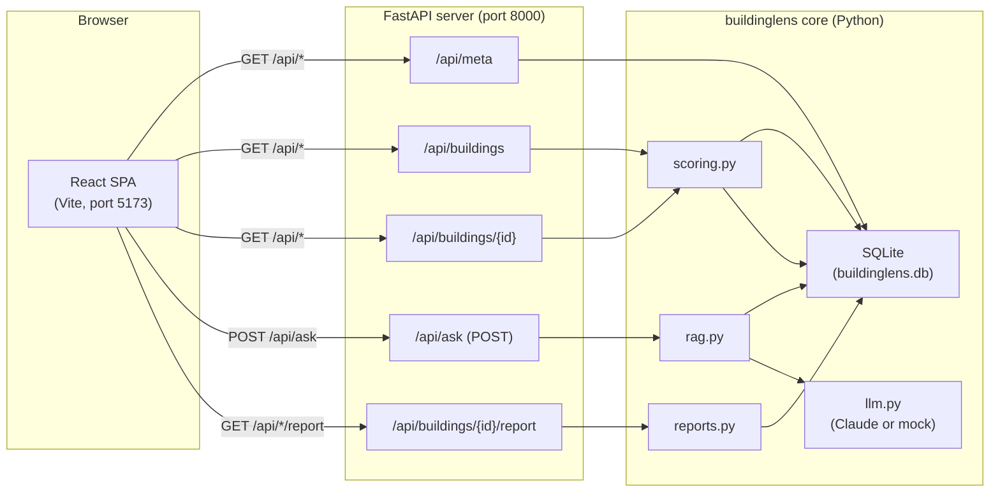

# Architecture

## Overview

BuildingLens has two front-end layers that share the same Python back-end logic:

- **Streamlit app** (`app/streamlit_app.py`, `main` branch): the original MVP, runs as a self-contained Streamlit process with no separate API server.
- **React SPA** (`web/`, `feature/react-app` branch): a polished, production-ready interface. Talks to a FastAPI server (`api/`) that exposes the same buildinglens core over HTTP.

The Python package `buildinglens` (under `src/buildinglens/`) is the shared core. Both front-ends reuse it directly.

---

## Components

### React SPA (web/)

Built with Vite 5 + React 18 + TypeScript strict + Tailwind CSS v3. Routing via react-router-dom v6. Charts via recharts. The interface is in English (react-i18next is wired in, with the French bundle kept dormant for a future switcher).

Three pages:
- `/` (SearchPage): free-text question, sent to `POST /api/ask`, answer and sources displayed.
- `/portfolio` (PortfolioPage): full building list ranked by risk score with KPI cards and a bar chart.
- `/building/:id` (BuildingPage): per-building detail, defect table, discipline and severity charts, Excel and PDF downloads.

During development the Vite dev server (`npm run dev`, port 5173) proxies every `/api/*` request to `http://localhost:8000`.

### FastAPI server (api/)

Thin HTTP adapter. Three routers:
- `api/routers/buildings.py`: list and detail endpoints.
- `api/routers/ask.py`: RAG question-answer endpoint.
- `api/routers/reports.py`: per-building Excel and PDF download.

A fourth route (`GET /api/meta`) lives directly in `api/main.py` and returns database row counts and the active LLM provider name.

CORS is configured to accept requests from `http://localhost:5173` and `http://127.0.0.1:5173`.

### Python core (src/buildinglens/)

| Module | Role |
|---|---|
| `pipeline.py` | Downloads public data (EUBUCCO buildings, STATEC permits), generates synthetic PDF reports, and populates SQLite. |
| `ingest_pdf.py` | Reads a PDF with pdfplumber and chunks the text. |
| `extract.py` | Calls the LLM to identify and classify defects in a chunk. |
| `scoring.py` | Computes a weighted severity-based risk score per building. |
| `rag.py` | Builds a LlamaIndex vector index (local sentence-transformers embeddings), retrieves relevant chunks, and calls the LLM to produce a cited answer. |
| `reports.py` | Generates per-building Excel (openpyxl) and PDF (reportlab) reports. |
| `llm.py` | Wraps the Anthropic Claude API; falls back to a deterministic mock when no API key is present. |
| `db.py` | Opens and initialises the SQLite database. |
| `config.py` | Reads `.env` (pydantic-settings). |

### Storage

A single SQLite file (`data/buildinglens.db`). Main tables: `buildings`, `documents`, `defects`, `chunks`, `embeddings`.

---

## Data flow

```
Browser (React SPA, port 5173)
        |
        |  HTTP /api/*  (proxied by Vite in dev, served directly in prod)
        v
FastAPI server (port 8000)
        |
        |  calls Python functions directly (no secondary network hop)
        v
buildinglens core
        |
        +---> SQLite  (buildings, defects, chunks, embeddings)
        |
        +---> LLM API (Anthropic Claude, or mock when key absent)
              RAG: retrieve chunks from the LlamaIndex vector index, send to LLM, return answer + citations
```

### Diagram (Mermaid)



---

## Branch strategy

The `main` branch ships the Streamlit MVP (`make run`). The `feature/react-app` branch adds the React SPA and the FastAPI server on top of the same `buildinglens` core, without modifying the Streamlit app or the data pipeline.
